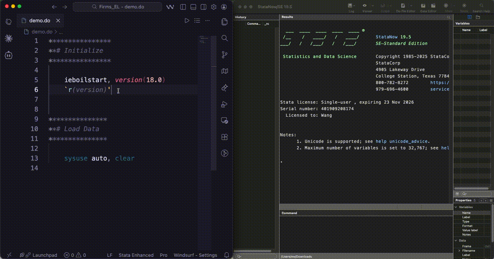
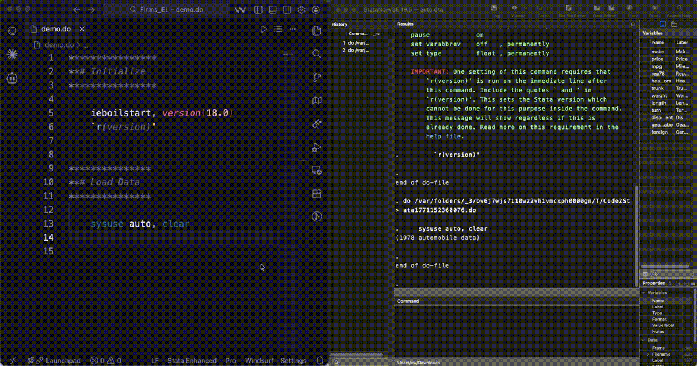

# Code2Stata

Run code on Stata GUI from VS Code on macOS. Sends code to the Stata GUI application and provides IntelliSense autocomplete for Stata commands and variables.

**Notes before use:** Make sure to select the correct Stata variant in the extension settings. The default is `stataSE`, but you may need to change it to `stataBE` or `stataMP` if you have a different variant installed.

## Features

- **Run Code**: Send selected code or the entire file to Stata
  - If text is selected, run the line of the selected text
  - If nothing is selected, the entire file is sent
  - Available via keyboard shortcut, editor title button, or right-click context menu
- **IntelliSense**: Autocomplete suggestions for built-in Stata commands, user-defined commands, and variable names from Stata's memory
- **Variable Retrieval**: Fetch variable names from the currently loaded Stata dataset for IntelliSense autocomplete
  - Manual retrieval via button
  - Automatic retrieval after running code
  - Timed auto-retrieval on a configurable interval

## Demo

- **Run Code**

- **IntelliSense**:

## Requirements

- **macOS**
- **Stata** (BE, SE, or MP; &ge; 17) installed on your Mac
- A VS Code language extension that provides the `stata` language ID (e.g., [Stata Enhanced](https://marketplace.visualstudio.com/items?itemName=kylebarron.stata-enhanced))

## Keyboard Shortcuts

| Shortcut | Command | Description |
|---|---|---|
| `Shift+Cmd+A` | Run Code | Run the line of selected code or the entire file |

Keybindings can be customized in VS Code's Keyboard Shortcuts editor. `Shift+Cmd+P` opens the Command Palette. Type "Open keyboard shortcuts" and select "Preferences: Open Keyboard Shortcuts".

## Extension Settings

`Cmd+,` opens the Settings editor. Search for "code2stata" to find the extension settings. Alternatively, in the Extensions sidebar, click on the gear icon on the right of the extension card and select "Settings".

| Setting | Default | Description |
|---|---|---|
| `code2stata.whichApp` | `stataSE` | Which Stata application to use (`stataBE`, `stataSE`, or `stataMP`) |
| `code2stata.focusWindow` | `true` | Bring Stata to the foreground when sending code |
| `code2stata.autoLaunch` | `true` | Automatically launch Stata when running code if it is not running |
| `code2stata.autoRetrieveVariables` | `true` | Automatically retrieve variable names on a timer |
| `code2stata.autoRetrieveInterval` | `30` | Seconds between automatic variable retrievals (minimum 5) |
| `code2stata.retrieveTimeout` | `30` | Minutes to wait for Stata to become free before variable retrieval fails |
| `code2stata.userCommands` | `[]` | Additional Stata commands/programs to include in IntelliSense autocomplete |

## Acknowledgments

This extension is based on [stata-exec](https://github.com/kylebarron/stata-exec) by Kyle Barron under the MIT License, and uses code from [stataRun](https://github.com/poidstotal/stataRun) by PoidStotal. All errors are my own.

Hao Wang | wanghao@berkeley.edu
